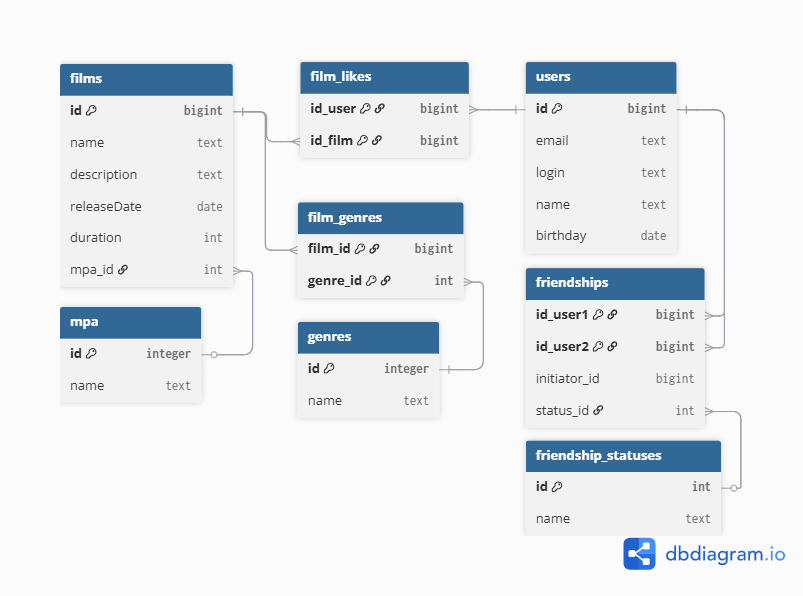

# Схема базы данных для проекта Filmorate

Этот документ описывает схему реляционной базы данных, спроектированную для приложения Filmorate. Схема нормализована до третьей нормальной формы (3НФ) для обеспечения целостности, гибкости и минимизации избыточности данных.

## ER-диаграмма

Ниже представлена ER-диаграмма (Entity-Relationship Diagram), которая визуализирует таблицы, их поля и связи между ними.



## Примеры SQL-запросов

### 1. Получение топ-10 самых популярных фильмов

Запрос находит 10 фильмов с наибольшим количеством лайков. Фильмы без лайков также участвуют в рейтинге (с 0 лайков).

```sql
SELECT
    f.id,
    f.name,
    COUNT(fl.id_user) AS likes_count
FROM
    films AS f
LEFT JOIN film_likes AS fl ON f.id = fl.id_film
GROUP BY
    f.id, f.name
ORDER BY
    likes_count DESC
LIMIT 10;
```
### 2. Получение всех друзей пользователя (для пользователя с ID = 5)
Запрос использует UNION для объединения двух выборок: случаев, когда пользователь является инициатором дружбы, и случаев, когда он является принимающей стороной.
```sql
SELECT u.id, u.login
FROM users AS u
INNER JOIN friendships AS fr ON u.id = fr.id_user2
WHERE fr.id_user1 = 5

UNION

SELECT u.id, u.login
FROM users AS u
INNER JOIN friendships AS fr ON u.id = fr.id_user1
WHERE fr.id_user2 = 5;
```
### 3. Получение общих друзей для двух пользователей (для ID = 1 и ID = 2)
Запрос находит пересечение (INTERSECT) двух списков друзей: сначала получаются все друзья для пользователя 1, затем для пользователя 2, после чего находятся только общие записи.
```sql
(SELECT u.id, u.login
 FROM users AS u
 INNER JOIN friendships AS fr ON u.id = fr.id_user2
 WHERE fr.id_user1 = 1
 UNION
 SELECT u.id, u.login
 FROM users AS u
 INNER JOIN friendships AS fr ON u.id = fr.id_user1
 WHERE fr.id_user2 = 1)

INTERSECT

(SELECT u.id, u.login
 FROM users AS u
 INNER JOIN friendships AS fr ON u.id = fr.id_user2
 WHERE fr.id_user1 = 2
 UNION
 SELECT u.id, u.login
 FROM users AS u
 INNER JOIN friendships AS fr ON u.id = fr.id_user1
 WHERE fr.id_user2 = 2);
```